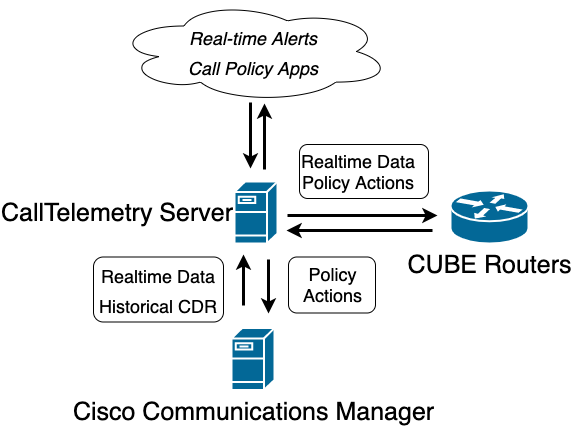

CallTelemetry uses realtime feeds to create actionable events from Cisco Callmanager.

Cisco Integration:

* CURRI API subscribes to realtime call event data from Cisco CUCM.
* CDR is processed to obtain additional telemetry, including MCID flags.

Both of these integrations are "push" integrations to CallTelemetry. No CUCM credentials are required for this integration, minimizing your security exposure.
# Architecture Diagram

