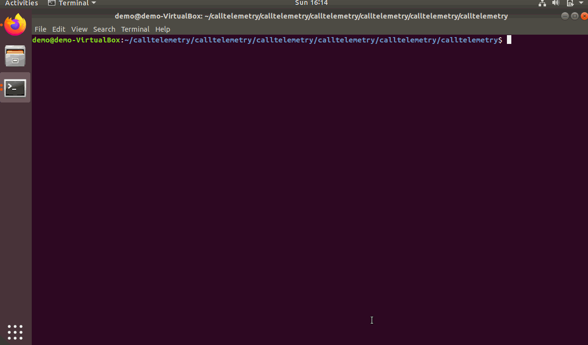

## Docker

Recommend: Ubuntu 18.0.4 

**2 Minutes** to both install Docker, and create an account!

Once docker boots, visit http://localhost, Sign up with any login you like.

  

#### Linux only: Change port 22 for CDR SFTP
Since we run our own SFTP server, so we need to change Linux's SSH port from 22 to 2222 (or any other port than 22). 
If you like VIM like me...
```
sudo vi /etc/ssh/sshd_config
```
Edit port from 22 to 2222. Save.
Restart Linux.
You will have to SSH to Linux on 2222 now, instead of 22.


#### Clone the Repo and Launch the containers!
``` bash
sudo apt install -y git
sudo snap install docker
sudo apt-get install docker-compose
git clone https://github.com/calltelemetry/calltelemetry.git
cd calltelemetry
sudo docker-compose up
```