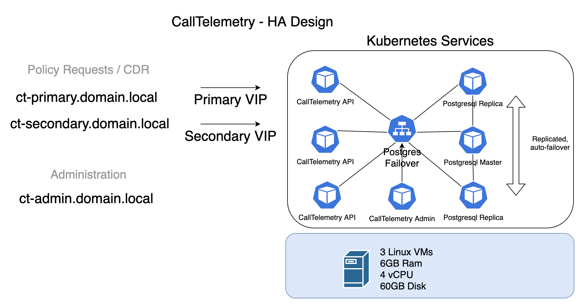

# Enterprise HA Cluster Guide

## Professional Installation support is available for clustered installs.

!!! note "This area is new and under development, this is intended to be a guide, but not self installed. Please contact me if you think this deployment fits your need. Once you have 3 machines ready, the entire cluster install can be done in under 30 minutes."
## Architecture
  

## Deploy 3 CentOS Servers
I am using CentOS 8.2. 
Configure your own DNS, Static IPs, etc.
# On ALL Nodes - Bootstrap script
CentOS only
Run this script to install kubectl, helm, and k9s, git and disable firewall.
```
curl https://raw.githubusercontent.com/calltelemetry/calltelemetry/master/ha-scripts/centos_prep.sh | sh
```
# Install First K3s Master Node
```
cd calltelemetry/ha-scripts
# Edit your master.sh file with your own variables. Just a couple IPs and passwords. See comments inside the file.
./master.sh
```

# Install K3s Masters 2 and 3
```
# On secondary nodes:
cd calltelemetry/ha-scripts
# Edit the secondary.sh file - change the IP to be your master
./secondary.sh
```

Check the health of the nodes before continuing - all should say running.

```
calltelemetry@hp-k3s-1:~$ kubectl get nodes
NAME       STATUS   ROLES                       AGE     VERSION
ct-node-1   Ready    control-plane,etcd,master   4m36s   v1.20.0+k3s2
ct-node-2   Ready    control-plane,etcd,master   40s     v1.20.0+k3s2
ct-node-3   Ready    control-plane,etcd,master   19s     v1.20.0+k3s2
calltelemetry@hp-k3s-1:~$
```


## Run Post-Install Script 
Scales up a couple resources to fill out your 3 node cluster.
(Run this on Node 1)
```
kubectl port-forward -n pgo svc/postgres-operator 8443:8443 &
curl https://raw.githubusercontent.com/calltelemetry/calltelemetry/master/ha-scripts/post_install.sh | sh
```

Wait a moment and check your SQL cluster
```
pgo test ctsql

cluster : ctsql
	Services
		primary (10.43.222.74:5432): UP
		replica (10.43.246.172:5432): UP
	Instances
		primary (ctsql-6895cd4bb-2f524): UP
		replica (ctsql-iulc-75ccc767c7-wwd2k): UP
		replica (ctsql-yzgz-8689bb9998-c2mlf): UP
```

Check the deployment - you should see 3 CallTelemetry-web servers running.

```
kubectl get pods

NAME                      READY   STATUS    RESTARTS   AGE
calltelemetry-web-fqlv5   1/1     Running   0          4m21s
calltelemetry-web-gp2f9   1/1     Running   0          4m21s
calltelemetry-web-zbkk6   1/1     Running   0          4m21s
svclb-traefik-4ngn8       2/2     Running   0          16m
svclb-traefik-6pmjw       2/2     Running   0          16m
svclb-traefik-chqsw       2/2     Running   0          16m
traefik-99bfb8458-8xdvj   1/1     Running   0          16m
```

Check your IPs assigned, you should see your IPs listed here
```
kubectl get services

NAME                      TYPE           CLUSTER-IP      EXTERNAL-IP       PORT(S)                      AGE
calltelemetry-primary     LoadBalancer   10.43.195.226   192.168.123.135   80:30609/TCP,22:32207/TCP    13m
calltelemetry-secondary   LoadBalancer   10.43.122.52    192.168.123.136   80:32049/TCP,22:32124/TCP    13m
kubernetes                ClusterIP      10.43.0.1       <none>            443/TCP                      2d18h
traefik                   LoadBalancer   10.43.171.164   192.168.123.139   80:31050/TCP,443:30731/TCP   22h
```

Setup DNS records to point to your 2 VIP IP Addresses for load balancing- primary and secondary.
Open a web browser to http://admin_cluster_IP and create an account.

Use these 2 VIP ecords for the CURRI API and CDR, and the cluster admin for management.


# Appendix / Troubleshooting

## If you need to find your SQL Password
In our case, the password for postgres user is calltelemetry

``` bash
/snap/bin/kubectl port-forward -n pgo svc/postgres-operator 8443:8443 &
pgo show user -n pgo ctsql --show-system-accounts

CLUSTER USERNAME    PASSWORD                 EXPIRES STATUS ERROR
------- ----------- ------------------------ ------- ------ -----
ctsql   crunchyadm                           never   ok
ctsql   postgres    calltelemetry            never   ok
ctsql   primaryuser random_pass never   ok
ctsql   testuser    random_pass never   ok
```

## SQL - Crunchy Data PostgreSQL Operator
[Cruncy Data PostgreSQL Operator Github](https://github.com/CrunchyData/postgres-operator)

[Crunch Data PostgreSQL Operator Docs](https://access.crunchydata.com/documentation/postgres-operator/4.5.1/)

[Cruncy Data PostgreSQL Quickstart](https://access.crunchydata.com/documentation/postgres-operator/4.5.1/quickstart/)