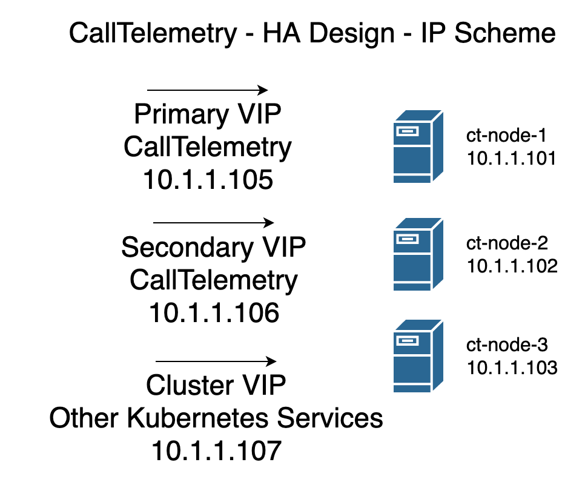

# K3S Cluster Guide

Although it is a long page, the entire deployment is only about 30 minutes.

## Architecture
  

## IP Addressing
  

## Deploy 3 or more CallTelemetry Cluster OVAs
[Download CentOS 8.3 OVA File - 900MB](https://storage.googleapis.com/ct_ovas/CT-cluster-040-centos-8.3-x86_64.ova)

The OVA includes a couple utilities - helm, kubectl, k9s, and saves you a little time "building" the OS. It's prebuilt from CentOS 8.3 with all updates applied.
You can install this on ANY linux distro, but the support required to do so is beyond my time. 

??? note "I want to install CentOS myself - what's missing?"
    # enable snaps
    yum install -y epel-release
    yum install -y snapd
    yum install -y wget
    systemctl enable --now snapd.socket
    ln -s /var/lib/snapd/snap /snap
    snap wait system seed.loaded
    systemctl restart snapd.seeded.service
    # install kubectl and helm
    snap install kubectl --classic
    snap install helm --classic


The nodes boot up and display their DHCP Address on login screen.
SSH to the nodes on port 22.
Default password is calltelemetry/calltelemetry

!!! note "It's OK to Change the password - it's not used anywhere else."

!!! warning "Change hostnames!"
    If you do not set the hostname per node, you will not get very far without things failing.

I recommend ct-node-1, ct-node-2, ct-node-3, etc, but this is your choice.
```
sudo hostnamect ct-node-1
```
Repeat for other nodes 2 and 3.

### Static IP the NICs is recommended.
in CentOS you can static the NICs like this
``` 
sudo nmtui
```

# Install First K3s Master Node
Time: about 2 minutes
Copy and paste this via SSH on the first node.

```
export INSTALL_K3S_CHANNEL=stable
export K3S_KUBECONFIG_MODE="0644"
export K3S_TOKEN="calltelemetry"
curl -sfL https://get.k3s.io | sh -s server --cluster-init --no-deploy traefik --disable servicelb
rm -rf .kube
mkdir .kube
sudo cat /etc/rancher/k3s/k3s.yaml > ~/.kube/config
```

# Install K3s Masters 2 and 3
Time: about 5 minutes

!!! note "Change the K3S_URL IP address to Master node 1's IP Address"

```
export K3S_URL="https://192.168.123.167:6443"
export INSTALL_K3S_CHANNEL=stable
export K3S_TOKEN="calltelemetry"
export K3S_KUBECONFIG_MODE="0644"
curl -sfL https://get.k3s.io | sh -s server - --no-deploy traefik --disable servicelb
rm -rf .kube
mkdir .kube
sudo cat /etc/rancher/k3s/k3s.yaml > ~/.kube/config
sudo cat /var/lib/rancher/k3s/server/node-token
```

Check the health of the nodes before continuing - all should say running.

```
calltelemetry@hp-k3s-1:~$ kubectl get nodes
NAME       STATUS   ROLES                       AGE     VERSION
ct-node-1   Ready    control-plane,etcd,master   4m36s   v1.20.0+k3s2
ct-node-2   Ready    control-plane,etcd,master   40s     v1.20.0+k3s2
ct-node-3   Ready    control-plane,etcd,master   19s     v1.20.0+k3s2
calltelemetry@hp-k3s-1:~$
```

# Install MetalLB, Scale DNS Pods, and Traefik Proxy
Time: about 5 minutes
Copy and Paste this block
```
kubectl apply -f https://raw.githubusercontent.com/metallb/metallb/v0.9.5/manifests/namespace.yaml
kubectl apply -f https://raw.githubusercontent.com/metallb/metallb/v0.9.5/manifests/metallb.yaml
kubectl create secret generic -n metallb-system memberlist --from-literal=secretkey="$(openssl rand -base64 128)"
kubectl scale deployment.v1.apps/coredns --replicas=3 -n kube-system
helm repo add traefik https://helm.traefik.io/traefik
helm repo update
helm install traefik traefik/traefik --set service.annotations."metallb\.universe\.tf\/address-pool"=default
kubectl create namespace pgo
kubectl apply -f https://raw.githubusercontent.com/CrunchyData/postgres-operator/v4.5.1/installers/kubectl/postgres-operator.yml
curl https://raw.githubusercontent.com/CrunchyData/postgres-operator/v4.5.1/installers/kubectl/client-setup.sh > client-setup.sh
chmod +x client-setup.sh
cat <<EOF >> ~/.bashrc
export PGOUSER="${HOME?}/.pgo/pgo/pgouser"
export PGO_CA_CERT="${HOME?}/.pgo/pgo/client.crt"
export PGO_CLIENT_CERT="${HOME?}/.pgo/pgo/client.crt"
export PGO_CLIENT_KEY="${HOME?}/.pgo/pgo/client.key"
export PGO_APISERVER_URL='https://127.0.0.1:8443'
export PGO_NAMESPACE=pgo
EOF
source ~/.bashrc
```

In about 3-5 minutes, all pods in the cluster should be "Running"
```
[calltelemetry@ct-node-1 ~]$ kubectl get pod -A
NAMESPACE        NAME                                      READY   STATUS      RESTARTS   AGE
default          traefik-99bfb8458-9wjnc                   1/1     Running     0          2m37s
kube-system      coredns-854c77959c-6nf88                  1/1     Running     0          2m59s
kube-system      coredns-854c77959c-cg9vg                  1/1     Running     0          8m10s
kube-system      coredns-854c77959c-g9jbr                  1/1     Running     0          2m59s
kube-system      local-path-provisioner-7c458769fb-hpk77   1/1     Running     0          8m10s
kube-system      metrics-server-86cbb8457f-lfswr           1/1     Running     0          8m10s
metallb-system   controller-65db86ddc6-fmnvv               1/1     Running     0          2m59s
metallb-system   speaker-j4xj5                             1/1     Running     0          2m59s
metallb-system   speaker-k84ln                             1/1     Running     0          2m59s
metallb-system   speaker-lrmj9                             1/1     Running     0          2m59s
pgo              pgo-deploy-clz5l                          0/1     Completed   0          2m36s
pgo              postgres-operator-7b94775688-dv6nm        4/4     Running     1          83s
[calltelemetry@ct-node-1 ~]$
```

!!! warning "Wait for postgres-operator to be running before continue"

# Deploy SQL HA with 2 Replicas
Time: About 5 minutes
## Run SQL the Setup Script
(Run this on Node 1) Leave this window open after running the port-forward.
You will have 2 windows open to Node 1.
```
./client-setup.sh
sudo mv .pgo/pgo/pgo /usr/local/bin
kubectl port-forward -n pgo svc/postgres-operator 8443:8443
```

## Open a SSH window to the same node in a NEW window

!!! note "You can change the SQL password here if you like."

```
pgo create cluster -n pgo ctsql -d calltelemetry_prod --replica-count 2 --password-superuser=calltelemetry
```

Check the status of the deployment by watching the pods deploy.

```
kubectl get pods -n pgo

NAME                                          READY   STATUS              RESTARTS   AGE
ctsql-6895cd4bb-2f524                         0/1     ContainerCreating   0          21s
ctsql-backrest-shared-repo-7d4648f796-wxrqh   1/1     Running             0          32s
pgo-deploy-fpcq2                              0/1     Completed           0          3m27s
postgres-operator-7b94775688-2sf4c            4/4     Running             1          2m14s
```
You should see 3 ctsql instances complete. Let's confirm they are online

```
kubectl get pods -n pgo

NAME                                          READY   STATUS      RESTARTS   AGE
backrest-backup-ctsql-gnbvl                   0/1     Completed   0          57s
ctsql-6895cd4bb-2f524                         1/1     Running     0          118s
ctsql-backrest-shared-repo-7d4648f796-wxrqh   1/1     Running     0          2m9s
ctsql-iulc-75ccc767c7-wwd2k                   0/1     Running     0          49s
ctsql-stanza-create-tkltr                     0/1     Completed   0          66s
ctsql-yzgz-8689bb9998-c2mlf                   0/1     Running     0          49s
pgo-deploy-fpcq2                              0/1     Completed   0          5m4s
postgres-operator-7b94775688-2sf4c            4/4     Running     1          3m51s

# Check your Cluster

pgo test ctsql

cluster : ctsql
	Services
		primary (10.43.222.74:5432): UP
		replica (10.43.246.172:5432): UP
	Instances
		primary (ctsql-6895cd4bb-2f524): UP
		replica (ctsql-iulc-75ccc767c7-wwd2k): UP
		replica (ctsql-yzgz-8689bb9998-c2mlf): UP
```

# Deploy CallTelemetry
Time: About 2 minutes
Copy and paste this into a text editor, edit it with your password if you changed it, and assign 2 static IPS for primary and secondary. Cluster IP start and end are not use for CallTelemetry, but helpful to be set.

This step creates a ct_values.yaml file in the local folder. Edit it on the server or in notepad.
Paste this directly into the shell.
```
cat <<EOF > ct_values.yaml
# ct_values.yaml
db_password: calltelemetry
primary_ip: 192.168.123.135
secondary_ip: 192.168.123.136
cluster_ip_start: 192.168.123.138
cluster_ip_end: 192.168.123.140
EOF
```

```
helm repo add ct_charts https://storage.googleapis.com/ct_charts/
helm repo update
helm install calltelemetry ct_charts/calltelemetry -f ct_values.yaml
```

!!! note "If you need to re-deploy new values, it is an upgrade instead - like this"
```
helm upgrade calltelemetry -f ct_values.yaml
```

Check the deployment - you should see 3 CallTelemetry-web servers running.

```
kubectl get pods

NAME                      READY   STATUS    RESTARTS   AGE
calltelemetry-web-fqlv5   1/1     Running   0          4m21s
calltelemetry-web-gp2f9   1/1     Running   0          4m21s
calltelemetry-web-zbkk6   1/1     Running   0          4m21s
svclb-traefik-4ngn8       2/2     Running   0          16m
svclb-traefik-6pmjw       2/2     Running   0          16m
svclb-traefik-chqsw       2/2     Running   0          16m
traefik-99bfb8458-8xdvj   1/1     Running   0          16m
```

Check your IPs assigned, you should see your IPs listed here
```
kubectl get services

NAME                      TYPE           CLUSTER-IP      EXTERNAL-IP       PORT(S)                      AGE
calltelemetry-primary     LoadBalancer   10.43.195.226   192.168.123.135   80:30609/TCP,22:32207/TCP    13m
calltelemetry-secondary   LoadBalancer   10.43.122.52    192.168.123.136   80:32049/TCP,22:32124/TCP    13m
kubernetes                ClusterIP      10.43.0.1       <none>            443/TCP                      2d18h
traefik                   LoadBalancer   10.43.171.164   192.168.123.139   80:31050/TCP,443:30731/TCP   22h
```

Setup DNS records to point to your 2 IP Addresses - primary and secondary.
Open a web browser to http://primary-ip and create an account.

Use these 2 records for the CURRI API, and the primary for the CDR desintation.


# Appendix / Troubleshooting

## If you need to find your SQL Password
In our case, the password for postgres user is calltelemetry

``` bash
pgo show user -n pgo ctsql --show-system-accounts

CLUSTER USERNAME    PASSWORD                 EXPIRES STATUS ERROR
------- ----------- ------------------------ ------- ------ -----
ctsql   crunchyadm                           never   ok
ctsql   postgres    calltelemetry            never   ok
ctsql   primaryuser random_pass never   ok
ctsql   testuser    random_pass never   ok
```

## SQL - Crunchy Data PostgreSQL Operator
[Cruncy Data PostgreSQL Operator Github](https://github.com/CrunchyData/postgres-operator)

[Crunch Data PostgreSQL Operator Docs](https://access.crunchydata.com/documentation/postgres-operator/4.5.1/)

[Cruncy Data PostgreSQL Quickstart](https://access.crunchydata.com/documentation/postgres-operator/4.5.1/quickstart/)