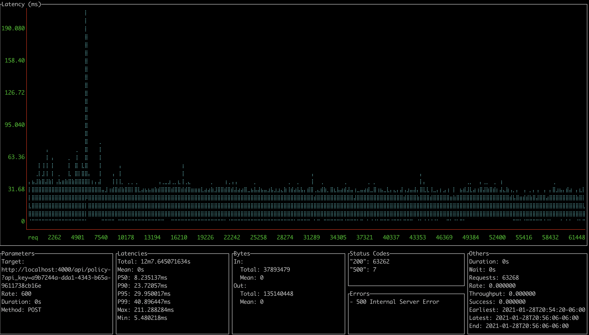

## Sizing Guide
The OVA as configured with 2 vCPUs can process 100 calls/second on consumer grade cores. Simply add more cores to increase capacity.

0.4.0 could process up to 35-50 calls per CPU core under 50ms.

0.4.1 adds caching which improved performance.

0.4.1 can process up to 75 calls per CPU Core, while keeping response time under 30ms.

Example testing on 0.4.1:

* i9 8 core - 600/calls/second, 30ms 95th Percentile Response time. 

If you need failover or scaling beyond cores in a single node, choose [Kubernetes](k8s.md)
