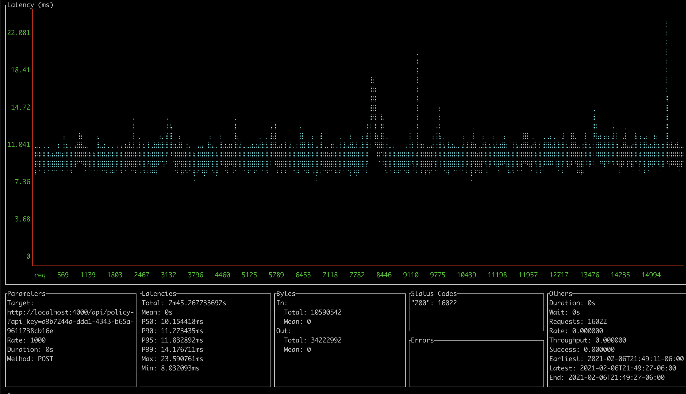

## Sizing Guide
CallTelemetry VMs are sized by cpu and call volume. 

Generally, estimate 100 calls per CPU Core per second as a max load. This varies based on the hardware you provide.

Stress testing on 0.4.1:

* i9-9880H 8 cores - 1,000/calls/second, under 12ms 95th percentile. 7 cores used for testing.

If you need failover or scaling beyond cores in a single node, choose [Kubernetes](k8s.md)
