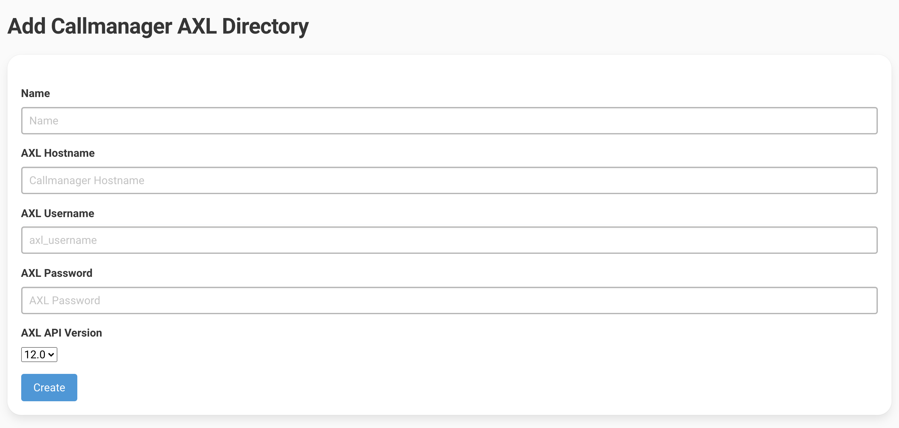
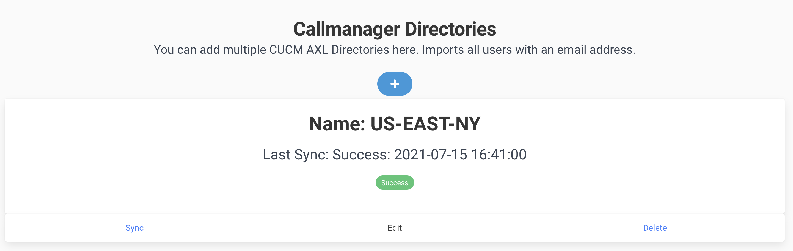
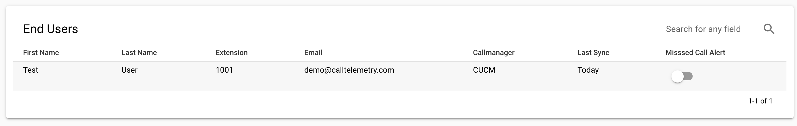

# AXL Sync

## You can add 1, or more Callmanagers to pull in Directory information from.
!!! note "Requires a user with read-only API AXL Access or higher."
!!! note "Data Synchronizes every 15 minutes, you can also manually sync."

# Add CUCM Directory
Add a Directory by filling out the form below under CUCM Directories -> Add.

Press the Sync button to manually initialize a synchronization. The page will return Success or failure, with the number of users found.

## Check End User Directories
Check if the User Directory is populated.

