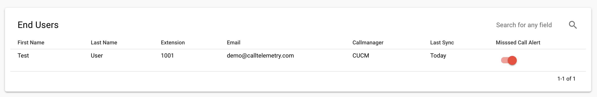

# Enable Missed Call Alerts 

# Requirements
* Enable CDR in Callmanager Service Parameters
* Enable Zero Duration Calls in Service Parameters
* Setup CDR Account to push to Call Telemetry SFP
* Add AXL Directory, synch must suceed
* Setup Org Level SMTP Parameters, send test email from that page to verify

!!! note "Missed Calls are triggered on Original Called Party, redirects or forwards will not trigger calls"

## Enable Missed Calls per user
Simply toggle the switch to be highlighted, and the user will receive missed call alert emails.

