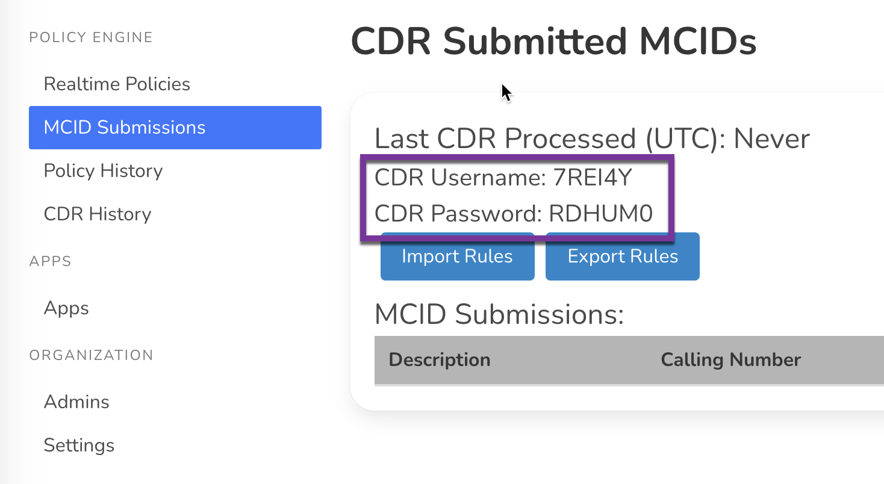
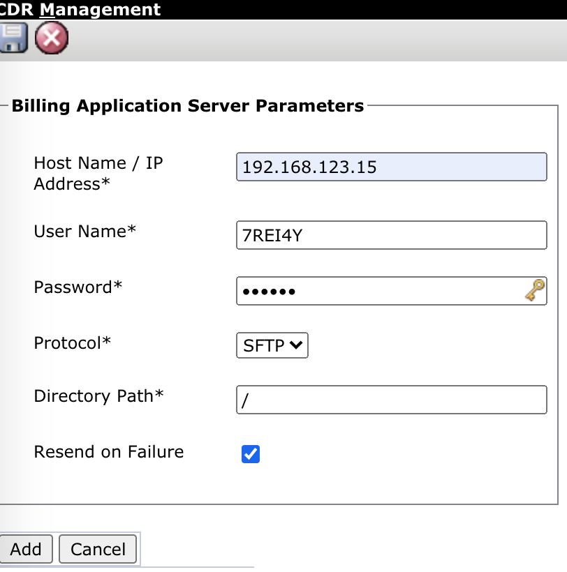

# CDR Server
CallTelemetry runs a SFTP Server that accepts Cisco CDR formatted files, processes them, and decodes every field.

!!! note "CDR Events do NOT trigger rule matches (yet)."

# 1. Obtain your CDR Credentials

# 2. Enable CDR Processing
## Within Callmanager Serviceability - CDR Management, add server.
