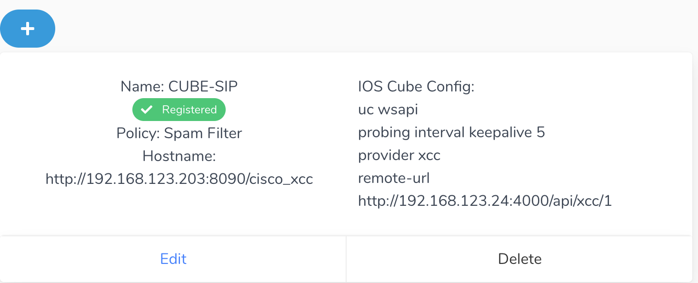

# Onborading Guide - CUBE Integration 

# How does CUBE Integration work?
We leverage the Cisco Native IOS XCC (Extended Call Control Service) API. 
Full documentation is available here 

# 1. Add a CUBE in Call Telemetry
{: style="height:200px;width:400px"}
Copy and paste the config generated to your CUBE. Make sure the CUBE can resolve the address.

# 2. Verify it shows as registered in Call Telemetry
If everything is right first time, the CUBE will show registered.
<!-- {: style="height:125x;width:150px"} -->
