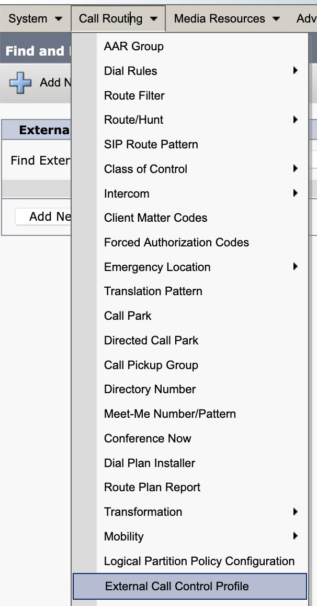
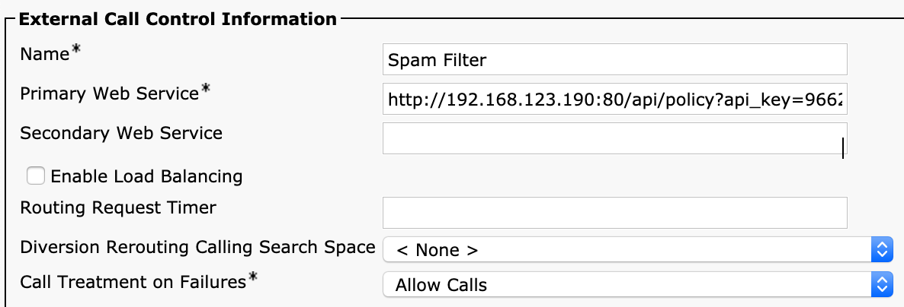
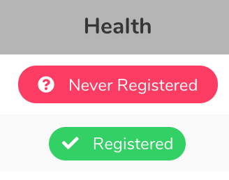

# Onborading Guide - External Call Control / CURRI 
# 1. In Callmanager, Create an ECC Profile
{: style="height:400px;width:250px"}

# 2. Point ECC Profile to Calltelemetry
{: style="height:200px;width:400px"}

Copy the URL from your Policies Page by clicking here. Docker will not expose the IP of the host, so in most cases you will get "localhost" as the hostname - replace that with the IP of the box.
{: style="height:100px;width:150px"}

#### Make sure to include port 80 as shown.
Fill in the ECC Settings
```
Name: Policy Name
Primary Web Service: http://calltelemetryhost:80/api/etc 
Secondary Web Service: If you are HA clustering - http://calltelemetryVIP2:80/api/etc
Enable Load Balancing: No for OVA, Yes for HA Clustered Deployment.
Call Treatment on Failures: Allow
```
# 3. Verify it shows as registered in CallTelemetry
Anytime you have an ECC Profile built in Callmanager, Callmanager will reach out and try to register to the policy server.
If your policy is not Registered, your rules won't work either.
{: style="height:125x;width:150px"}
