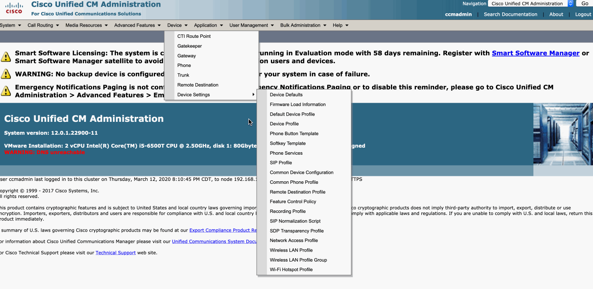

# MCID (Malicious Call Identification) 
MCID was released in Callmanager 4.0.1, in 2004. It's a softkey on the phone built into Callmanager. When the user is on a call, they can press "MCID", this will flag the call in CDR records. CallTelemetry Server will process CDR and look for the flag, and add it to the Call Policy API as a block rule.

Read more about the MCID Feature from [Cisco](https://www.cisco.com/en/US/docs/voice_ip_comm/cucm/admin/4_0_1/ccmfeat/fsmcid.html)

** You must be sending CDR to CallTelemetry Server. Click [here](cdr.md) if you need that guide.

# Step 1. Enable the MCID Softkey
1. Device -> Device Settings -> Softkey Features
2. Copy the Default Softkey to a new template
3. Go to Softkey Configuration
4. Go to Connected State
5. Add MCID Softkey
6. Apply softkey to phones, or set as Default

# Step 2. Demonstration of the MCID Softkey
MCID creates a rule with calling AND called number(the user submitting). A submission will never cause other user's calls to be blocked.

Any user worldwide can now submit their own unique blocked call based on the calling and called event. 

