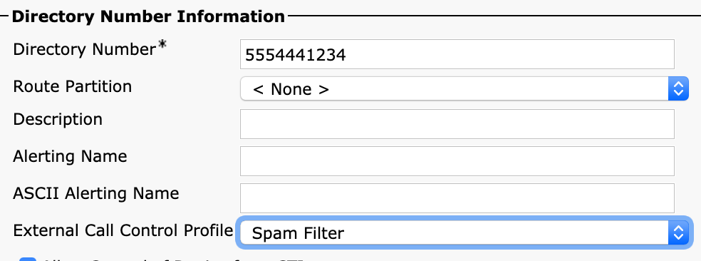

# Policy Deployment Guide

## CURRI & "Fail to Passthrough"

CURRI is a stateful protocol, and no routing is done through it. It's only a policy response engine - returning continue, block, or modify.

A keepalive must also be maintained. If anytime the heartbeat fails, or a bad response is given, calls revert to the "Call Treatment on Failures" policy in the CURRI/ECC Profile - which most customers leave as "Allow".

There is never a single point of failure, as CUCM will fail "open".

# How CURRI works

Curri only inspects Inbound Events. Meaning, you must apply the policy to an object receiving the event for it to receive events.

It could be Inbound to Phones, Inbound to a Pattern or Translation.

!!! note "CURRI/ECC does not inspect outbound events generated from the device applied to."

Example 1 - if a phone has an CURRI/ECC Policy applied, and it dials outbound to a pattern without a policy applied - this event is not processed.

Example 2 - if a phone does NOT have a policy applied, and it dials outbound to a pattern WITH a policy applied - this event is processed.

# Inspect Inbound Calls Only

Some customers only inspect inbound calls coming from CUBEs, Gateways, into CUCM. This reduces the processing of the Policy API, and provides inbound call protection.

# Inspect calls on Phones

You can apply ECC profiles to a single phone. All calls received on that phone will be inspected. Or if you want to inspect more phones, you can use Bulk Tools like BAT for large applications.

# Inspect calls on Route Patterns

You can apply a policy on outbound patterns to inspect outbound calls,like 911 patterns, or Outbound Route Patterns for compliance reasons, or alerting.

## Example for a phone

{: style="height:200px;width:400px"}

## Example for a Route / Translation Pattern

{: style="height:200px;width:400px"}
